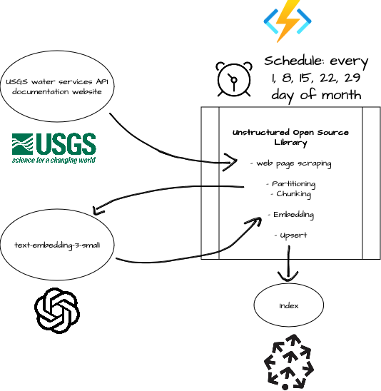

# USGS Knowledge Base Q&A RAG Chain

To build a retrieval augmented generation chain for our USGS knowledge base Q&A, we automate these steps using Azure Functions on a schedule:

1. Identify relevant documentation URLs [USGS water services documentation](https://waterservices.usgs.gov/docs) along with child pages
2. Partition Retrieved URLs using Unstructured
3. Chunk contents of partitioned documentation
4. Embed chunks using OpenAI's `text_embedding_3_small`
5. Delete old embeddings from Pinecone index and upload new ones

The scheduled updates allow for automatically updating the embeddings when the contents of the documentation is updated by USGS.
